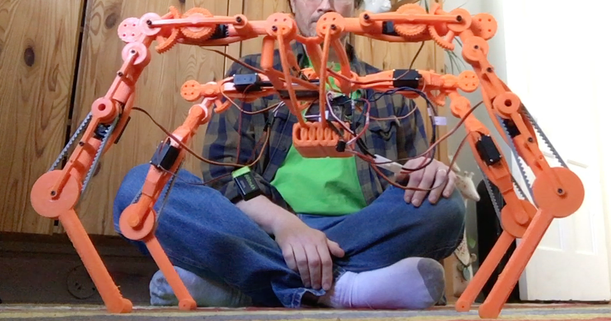
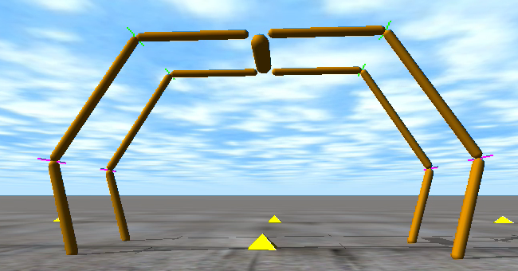
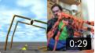

# Tomm-I

The Tomm-I robot is a home robot hobby project. The goal is to build a small dog-size four-legged robot and teach it to walk.

The robot is made of 3D printed parts plus some standard commerical servos and an arduino system to control it (for now).

<table border="0">
  <TR>
    <TD></TD>
    <TD></TD>
  </TR>
  <TR>
    <TD> Photo of an early version of the robot.</TD>
    <TD> Screencap of the Tomm-I-sim simulation of the robot.
  </TR>
</table>

A YouTube video of the simulation and real robot executing the same sequence of actions can be seen here:

  

